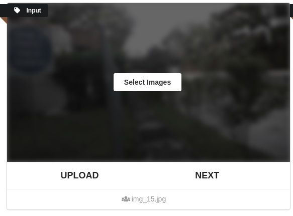
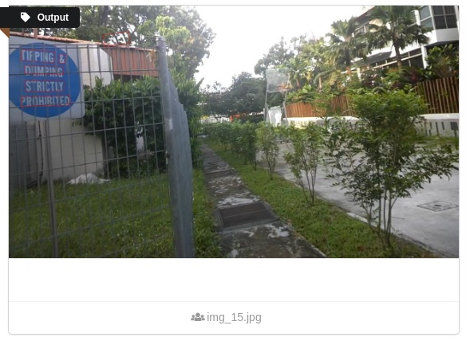
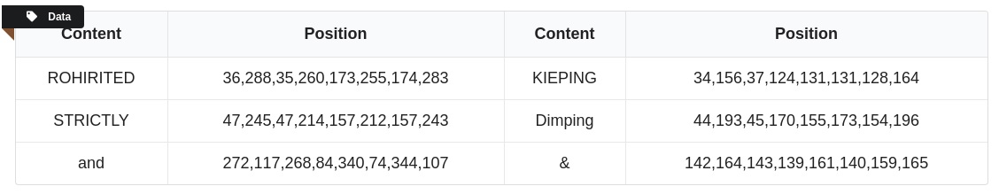

# Two-stage text recognition online system

### Introduction
This is a web implementation of text recognition. 
It's model consists of two parts - detection and recognition, of which recognition is ASTER : [An Attentional Scene Text Recognizer with Flexible Rectification](https://ieeexplore.ieee.org/document/8395027) implemented by [bgshih](https://github.com/bgshih/aster) . Base framework of detection part is [EAST: An Efficient and Accurate Scene Text Detector](https://arxiv.org/abs/1704.03155v2) and some improvements are added into the model. 
The web is build with Flask. While the application server is starting up, network model will be stored and wait for image input until the server is shut down. You can choose more than one images and view their results one by one.

### Contents
1. [Setting](#Setting)
2. [Download](#download)
3. [Usage](#Usage)
4. [example](#Example)
5. [Data_Flow](#Data_Flow)

### Setting
1. pip install -r requirements.txt (tensorflow version must be 1.4.0 or it won't work)
2. set parameters according to your work environment: .
   + .flaskenv - These parameters will be added into os path and you can get them using `os.environ.get()`.
   + output.py - `tf.app.flags` parameters for model restore.

### Download
1. [resnet_v1_50 model](https://drive.google.com/drive/folders/1Wlq0GSlm06rB_Mk9eL5JccaL57_JU3jO?usp=sharing) or visit https://github.com/tensorflow/models/tree/master/official/resnet. It's placed in  `model\data\resnet_v1_50`.
2. [detection model](https://drive.google.com/drive/folders/1Wlq0GSlm06rB_Mk9eL5JccaL57_JU3jO?usp=sharing). It's placed in `model\data\detection_ckpt`.
3. [recognition model](https://drive.google.com/drive/folders/1Wlq0GSlm06rB_Mk9eL5JccaL57_JU3jO?usp=sharing). It's placed in `model\aster\experiments\demo\log`.

### Usage
1. server start up - `flask run` in your Terminal.
2. visit http://127.0.0.1:5000/ in your browser[^1].
3. select one or more images containing words as your input.
4. upload current image.
5. view output.
6. next image or re-select images and upload.

[^1] Load js and css files and the server is Inefficient, so it maybe take a long time. If you don't want to waste time and can endure ugly page, you can annotate the css and js but `jQuery.js` in index.html.

### Example
1. input

2. output

3. data

### Data_Flow
1. `flask run` : 
   > (1) `main.py` set system environment variables[^1].   
   > (2) `app/_init_.py` (import app)  start up flask.  
   > (3) `model/output.py` the server begin to maintain a model object - restore checkpoint file and wait for input. 

[^1] In the project, variables set by .flaskenv are used in many places. So in the `main.py`, `import app` must be after the `load_dotenv()`.

2. upload image :
   > (1) `app/routes.py upload_image()` receive image and save it into `model\test_images\images` . 
   > (2) `model/output.py` put image in the model graph and the output image will be saved in `app\static\output`. At the same time, `json_dict` variable stores the text data and it will be forwarded to the page. 
